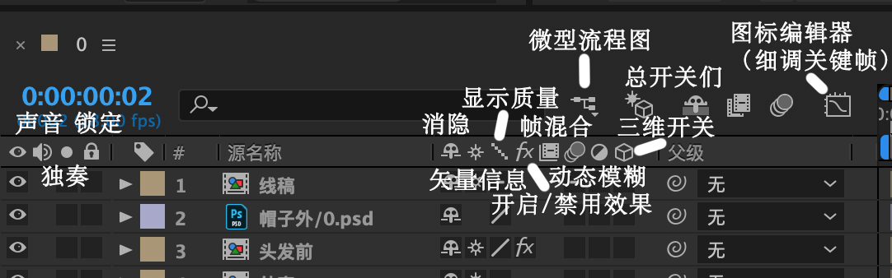
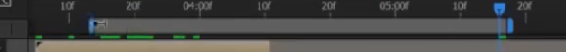
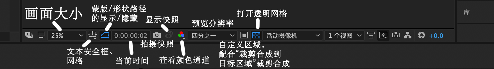
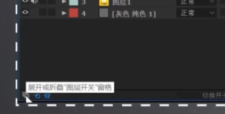
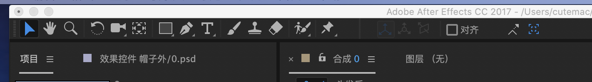

# AE quick notes

## 快捷键

### 素材调整快捷键

解释素材（调整素材本身参数）：cmd+alt+g，可改变alpha模式、帧速率、场，或循环播放素材

替换素材：cmd+h

### 合成快捷键

新建合成：cmd+n

合成设置：cmd+k

### 图层操作

#### 单图层操作

图层锚点居中：cmd+alt+home

图层适配合成宽高：cmd+alt+f

时间重映射：cmd+alt+t

##### 单图层控制

锚点：a

位置: p

缩放: s

旋转: r

不透明度: t

音频电平大小：L

音频波形图：LL

蒙版路径：m

蒙版所有属性：mm

蒙版羽化：f

源文本：uu

显示所有关键帧：u

显示所有表达式：ee

添加表达式：alt+单击关键帧码表

（表达式可用于实现较复杂效果，如抖动、循环、随机等）。在动画->关键帧辅助中可找到将表达式转为关键帧。关键帧可在图表编辑器中进行细致调整。

[Note about expressions](../ae_expression/README.md)

#### 多图层操作

复制图层：cmd+d

将图层放在最顶端：cmd+shift+]	最底端：cmd+shift+[

将单个/多个图层预合成：cmd+shift+c

**剪辑图层**：alt+[ / alt+]

在当前时间点分离图层：cmd+shift+d

将播放头快速定位到图层入点/出点：i/o

将图层入/出点定位到播放头位置：[ / ]	*tip:选择多个图层后用左右方括号对齐图层*

定义工作区（渲染输出区域）：b/n

*tip：在此处右键可将合成裁剪为指定工作区，缩短合成时长*

### 其它

标尺：cmd+r

合成微型流程图：tab

切换图层窗口左上角显示时间/帧数：cmd+点击

## 界面操作：

### 预览界面：

缩放：鼠标滚轮

平移预览位置：按住滚轮

### 图层界面：

展开和折叠图层控制开关：图层窗口界面左下角

### 工具栏：

（下列顺序自左向右）

选择工具：快捷键v 

抓手：不常用，鼠标中键替代

缩放：鼠标滚轮替代

旋转工具：快捷键w，也可通过r调出图层旋转属性进行旋转

摄像机工具*4: 快捷键c，长按鼠标左键可调出

	1. 统一摄像机（最常用），在有摄像机图层的合成里操作三维空间摄像机。按左键拖动为环绕摄像机，中键拖动为平移，右键为拉镜（缩放）。

锚点工具：快捷键y

矩形/椭圆系列工具：快捷键q。在选择图层情况下，可给图层添加蒙版；不选择图层情况下，可新建形状图层。

钢笔工具：快捷键g。类似，选择图层得到蒙版，不选择得到形状图层。鼠标单击绘制锚点，多个锚点确定一条路径，alt+单击锚点可转换锚点插值模式（线性/贝塞尔曲线）。按住alt拖动锚点左右手柄可分别调整两边弧度，按shift可平行切线拖动左右手柄。右键锚点->蒙版和形状路径可选择路径封闭或断开，或设置任一点为第一个顶点。

文本工具：快捷键ctrl+t

画笔/仿制图章/橡皮：选择图层并右键打开图层（或双击图层）后对图层进行编辑。

*tip：以上三者与rotobrush 均为打开图层后对图层操作*

rotobrush：用于复杂图层抠像

图钉（木偶工具）：对图层打点并自由变形。

## 渲染输出

添加到渲染队列：cmd+m（也可在菜单栏合成中找到）

渲染设置和输出模块可在编辑->模版中自定义默认设置。

# todo：

文本图层、形状图层，摄像机，灯光，跟踪

