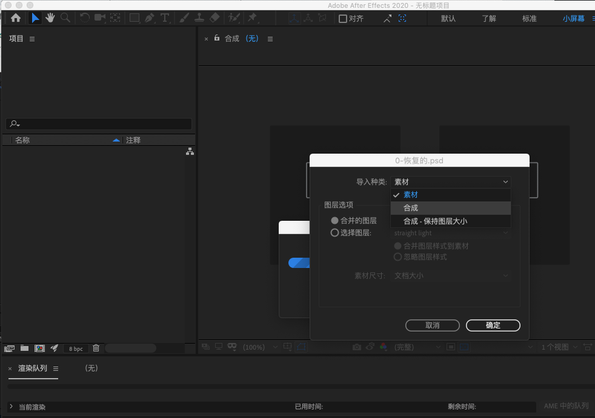
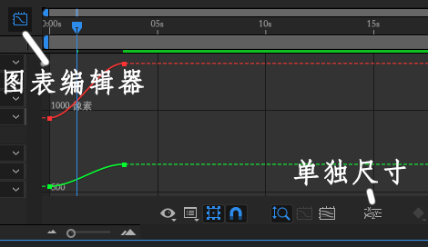
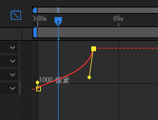
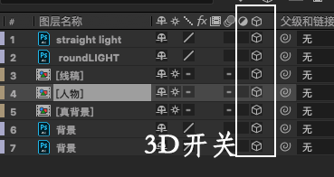
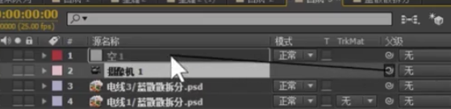
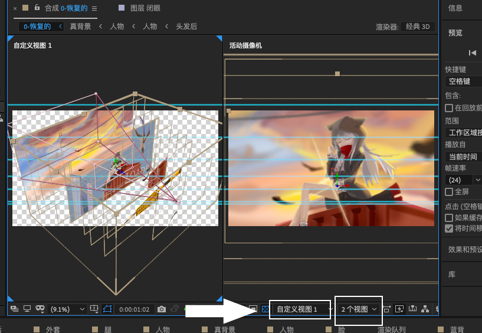
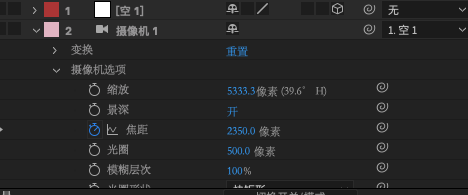
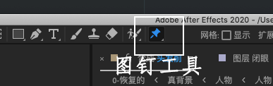
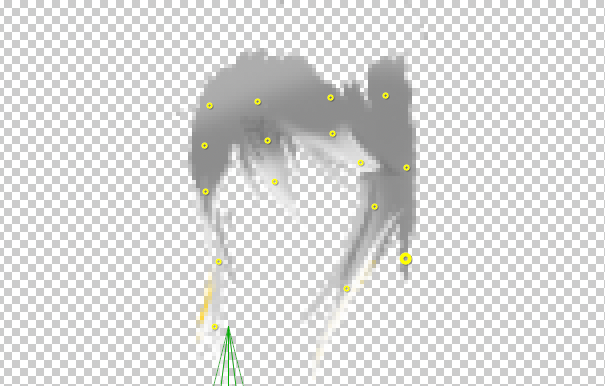
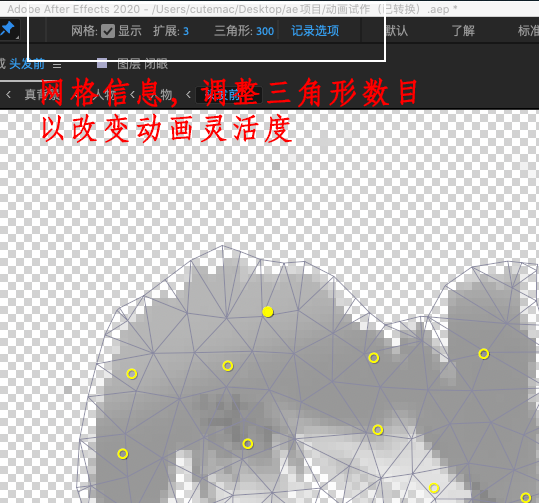

# 伪3d效果以及曲线及图钉工具使用

## 素材导入及合成调节

双击左侧素材面板，选中所需素材（psd文件）并导入，选择以合成形式导入。这样，在psd文件中所做的修改会被同步到ae中。

如需调整合成大小等信息，可`cmd+k`调出合成设置进行调节。调整大小后，可全选所有图层后点击s调成图层缩放大小。

## 曲线工具使用

k帧后，鼠标拖动框选需要调整速率所有关键帧，按F9设置缓动。

之后点击图标编辑器，点击xy单独尺寸，方可对曲线进行调节。

调整后曲线效果如下：

## 伪3d效果制作，摄像机基本使用

==tip: 伪3d效果要求有前后关系图层必须分开==

**step1**:打开所有需要前后关系图层3d开关。注意，所包含预合成（如[人物]）中3d开关也必须全部打开，否则图层无法受摄像机控制。

**Step2**: 在图层窗口右键，新建空对象和摄像机，打开空对象3d开关，并将摄像机父级设定为空对象（拖拽父级开关到空对象）。

之后即可通过移动空对象来移动摄像机。

**step3**: 按p键调出任意图层位置信息，可以看到打开3D开关后多出了z轴坐标。根据需要调整各图层前后关系，一半以500或1000为单位调节效果较明显。

*tip: 如果调节后图层大小不合适，按s调整缩放即可。*

*tip：可以通过调出两个视图并将第二视图视角选择为”自定义视图1“，即可方便的观测各图层前后位置.*

**step4**：景深制作。打开摄像机层详细数值（摄像机选项），打开景深，调大光圈，根据需求调节焦距。

**step5**: 对空图层进行移动即可得到3d拉镜效果。

## 图钉工具，头发飘动效果

**step1**：打开需要动画效果图层，使用图钉工具进行定点。

控制点可理解为关节，对需要运动或固定的地方进行打点。

头发层打点后效果：

*tip: 可通过调节三角形数控制动画灵活度。网格越多则运动越柔软。*

**step 2**: 选中须操控的图层并按u可调出所有关键帧信息。之后可对每一个点分别进行k帧，以制作动画。同理，可框选所有关键帧并F9设置缓动以使运动更流畅。

