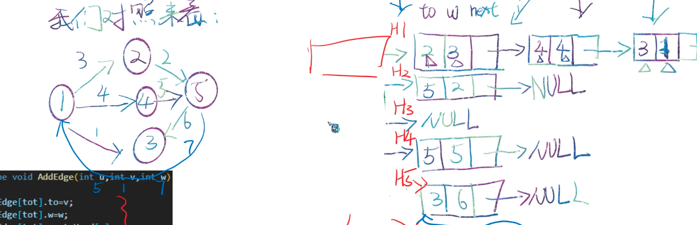

# 链式前向星

## 一种用于存储图的数据结构

可以加边，但不能执行删边操作。

本质上就是邻接表的数组实现。数据结构如下：

```c++
class Edge{
  int to;	// 这条边指向哪
  int weight;	// 边的权重
  int next;	// 下一个从属于这条边起点的边
};

Edge[EDGE_NUM] edges;	// 存储所有边的数组
int tot;		// 指向edges数组中第一个尚未使用的元素，加边的时候从它指向的地方加。
int head[NODE_NUM]; // node【0】：以0号节点为起点的第一条（其实第几条无所谓）边在edges的哪里。通过这条边即可遍历所有0号节点开头的边。

// 加边函数
void addEdge(int start, int end, int weight){
  edges[tot].to = end;
  edges[tot].weight = weight;
  edges[tot].next = head[start];	// 相当于在链表的头部加上这个新的边节点，而不是尾部
  head[start] = tot++;	 
}
```



(若要添加5->1权重为7的边，将h5指向【1，7，】，【1，7，】的next指向【3，6，】)