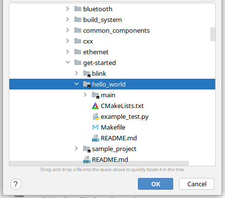
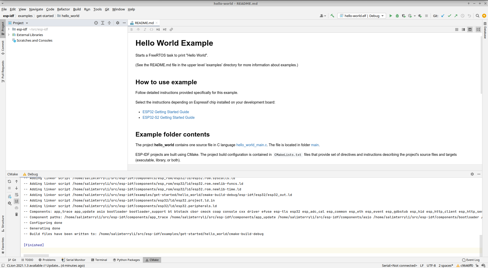
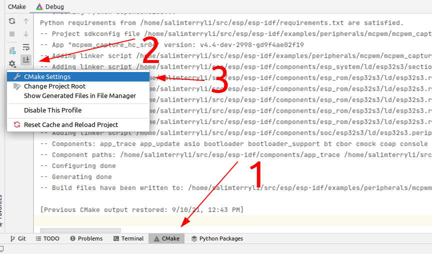
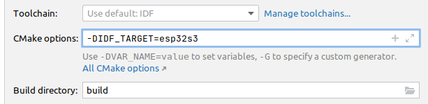
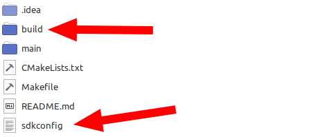

# [WIP]Work with ESP-IDF under Clion IDE

Since IDF v4.0 cmake becomes part of the default toolchain, make it quite  convenient to develop native esp32 (and further c3, s3) projects with  modern IDE like Clion. This could be a great news for newcomers from CS  (not EE) like me, to get full assistant from IDE while developing  embedded projects.

No extra plugins is needed. Just a few cmake flags need to be cared about manually.

## [#](https://blog.cnstl.tech/esp32/work_with_clion.html#before-the-beginning) Before the beginning

#### [#](https://blog.cnstl.tech/esp32/work_with_clion.html#this-article-will-cover-the-following-parts) This article will cover the following parts

- Run Clion within ESP-IDF enabled environment
- Load and build an esp32 example project in Clion
- Configure the project for esp32c3/s3 target and works with Clion
- Load and build unit-test-app

#### [#](https://blog.cnstl.tech/esp32/work_with_clion.html#currently-not-covered) Currently not covered

- flash and monitor inside Clion
- OpenOCD debug

#### [#](https://blog.cnstl.tech/esp32/work_with_clion.html#assumed-condition) Assumed condition

- You are on the latest Linux Mint / Ubuntu. Other deb based distributions should work. Arch users know what they need to do.
- Have ESP-IDF successfully installed and at least examples can be built and flashed from cli.

I strongly recommend to set the `get_idf` alias for convenience. It is not recommended to make IDF available for  every console session as default, so at least we should be able to load  IDF environment with command as short as possible.

There is also some difference between different desktop environments. I'm on xfce.

#### [#](https://blog.cnstl.tech/esp32/work_with_clion.html#check-again) Check again

Now you should have cloned IDF repo and finished the install progress. You should also have Clion installed and works normally.

For convenience, `get_idf` should also be set as an alias to load IDF specificed environment to current session.

Make sure you can build any projects by following the [official guide](https://docs.espressif.com/projects/esp-idf/en/stable/esp32/get-started/index.html#step-8-build-the-project)

[ ](https://docs.espressif.com/projects/esp-idf/en/stable/esp32/get-started/index.html#step-8-build-the-project)

[ (opens new window)](https://docs.espressif.com/projects/esp-idf/en/stable/esp32/get-started/index.html#step-8-build-the-project).

## [#](https://blog.cnstl.tech/esp32/work_with_clion.html#setup-idf-enabled-clion) Setup IDF-enabled Clion

If you ever tried to load IDF projects directly in Clion then cmake will  complain about missing toolchains and will not succeed. That is because  IDF related dependence is not included in your session which Clion  launched from. There is a way to manually configure them out but is too  complex and annoying so I personally never recommend that method.  Another way is simply launching the Clion from a session where IDF is  already available.

Open a terminal and type `get_idf`  to load IDF env, then locate where Clion is and launch it. It is  expected to have Clion running under IDF now and cmake will  automatically sort out everything when IDF projects are opened. No error should be there now!

Not very convenient because everytime you  should open a terminal at first, load IDF, and start Clion from command  line. This step can also be simplified with the help of a simple bash  script.

Create a file under `~/.local/bin`, named `idfclion` with following commands:

```shell
cat << EOF
#!/bin/bash
. /path/to/idf/export.sh
/path/to/clion.sh
EOF > ~/.local/bin/idfclion
```

Where `/path/to/clion.sh` should be replace with true one on your system. The same for `/path/to/idf` . They should be absolute path. Note IDF path is the directory where you have cloned the esp-idf repo.

Then make it executable:

```shell
chmod +x ~/.local/bin/idfclion
```

Now you should able to launch an IDF-enabled Clion with a single command `idfclion`.

With this method no root permission is required and it only works for current user.

Then I'd create a desktop entry for it. It differs with different desktop environment so please search and try it by yourself.

Finally I got those two icons on my desktop


The first one for normal projects and the second one for IDF.

## [#](https://blog.cnstl.tech/esp32/work_with_clion.html#open-the-hello-world-project) Open the hello world project

So by now an IDF-enabled Clion is configured, next topic is how to use it.

Switch to IDF repo directory(`$IDF_PATH`) and you will find the `examples` lying here. The directory `examples/get-started/hello_world/` contains a hello-world example ready to be tested.

From Clion menubar choose "Projects" => "Open", navigate to where hello-world project exists



Press OK. Then Choose "Open as CMake project".

On newer Clion it will ask to trust the project. To make everything works then click "Trust Project".

Now Clion will open a wizard to configure cmake profile. Those settings can also be changed later. To keep the same behavior as idf.py, we can fill the "Build directory" with `build`. Click "OK". That's all.



You can build from menubar "Build" => "Build Project" to see if everything works.

To flash the firmware onto device, you cannot directly use `idf.py` for that. Here we must manually switch to a new console and executing `make xxx` manually because the build directory is populated by Clion, which only support Makefile but not ninja.

> `idf.py` comes with ninja build system, which can provide better profermance.  But both makefile and ninja can be generated from cmake as its backend

Assume that we are still working at `examples/get-started/hello_world/`. After the project gets populated by Clion there will be either `cmake-build-debug` or `build` which contains the actual build. cd to that directory.

To flash the project onto boards we must first manually specify which UART port out board is present. Take a look at `ls -l | grep tty` and see if there is any `ttyUSBx` or `ttyACMx`.

Then set the correct value with what we found in the previous step.

```shell
export ESPPORT=/dev/ttyxxxx
```

`idf.py` will automatically do this for us but with pure cmake it is required to be done manually.

Finally the last step:

```shell
make flash monitor
```

The code will be compiled flashed to the board, and open a monitor to see the output. To exit the monitor please press `CTRL + ]`.

## [#](https://blog.cnstl.tech/esp32/work_with_clion.html#developing-chips-other-than-esp32) Developing chips other than ESP32

ATTOW there are 5 chips that is comfirmed to be supported with ESP-IDF:

- ESP32
- ESP32S2
- ESP32C3
- ESP32S3
- ESP32H2

All of them share the same set of drivers and examples (may differ).

Back to the previous chapter where Clion opens a wizard to configure cmake  profile. That window can also be opened from the buttom left corner



The only things that should change is



Where `esp32s3` can be replaced with the chips listed above.

**DON'T** press the OK button in a hurry. There still something need to do to avoid magic problems caused by cached makefile. `sdkconfig` and everything under `build` directory need to be deleted to let cmake do a fresh generation. `build/` may not exist and `cmake-build-debug` exists instead, if you forget to change build directory in Clion. Doesn't matter at all.



At this point it's OK to press OK. Now you are developing for another chip.