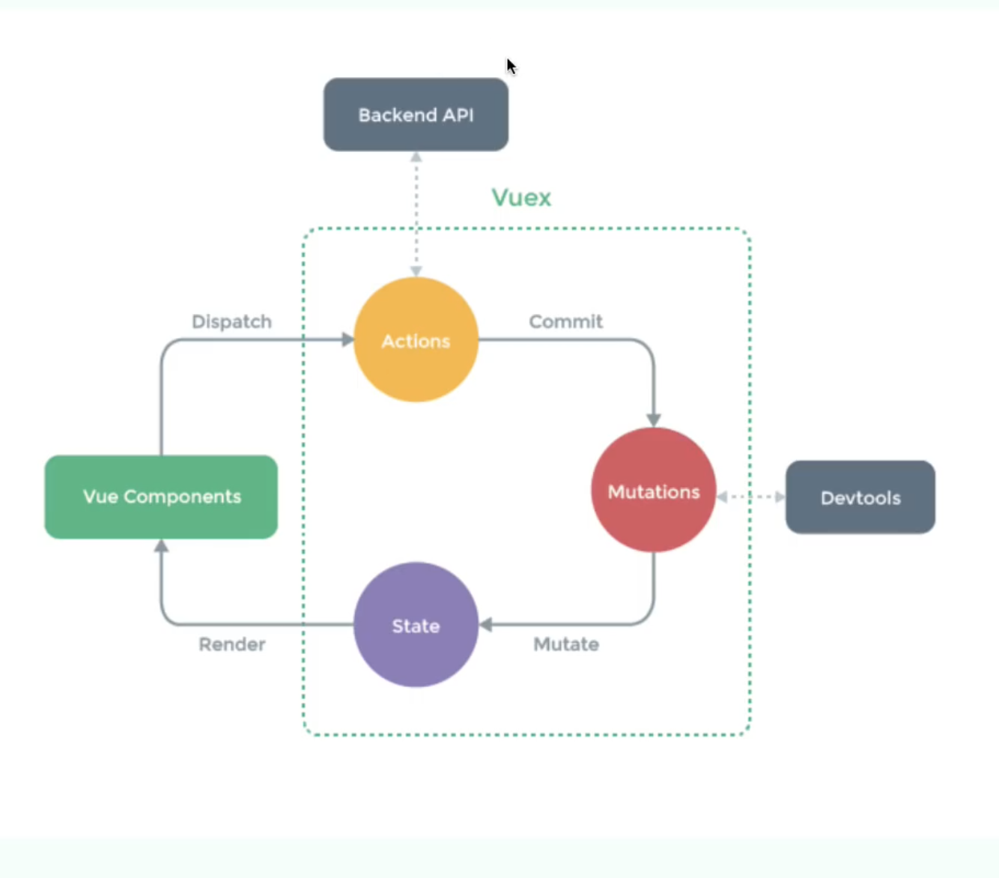

# Vuex

A  state management & state pattern library.

Certralized store for all components.

## Why use vuex

- Components need to share state in many cases
- Vuex provides a single source of truth for data/state
- No need to pass events up and props down through multiple components
- Global state is "reactive", if we update one component's state, every other component uses that state would update at the same time

## Concepts



- State -App-level state/data(todos, posts, token, etc)
- Getters - Get pieces of state or computed values from state
- Actions - Called from components to commit a mutation
- Mutations - Mutate the state(Update data, etc)
- Modules - Each module can have their own state, getters, actions & mutations(post module, auth module, etc)

## Codes

### set up

1. Create a folder names *store* in the root folder. 

2. In *store* folder create a file called *index.js*. It's an entry point to vuex.

   ```javasc
   import Vuex from 'vuex'
   import Vue from 'vue'
   // Also import your component here
   
   // Load Vuex
   Vue.use(Vuex)
   
   // Create store
   export default new Vuex.Store({
   	modules: {
   		// Add your modules here
   	}
   })
   ```

   3. Import store in main.js

   ```js
   import store from './store'
   
   // Add store to Vue instance
   new Vue({
     store,
     //Other things....
   }).$mount('#app');
   ```

   

   3. Create modules in store/modules, E.g todo.js