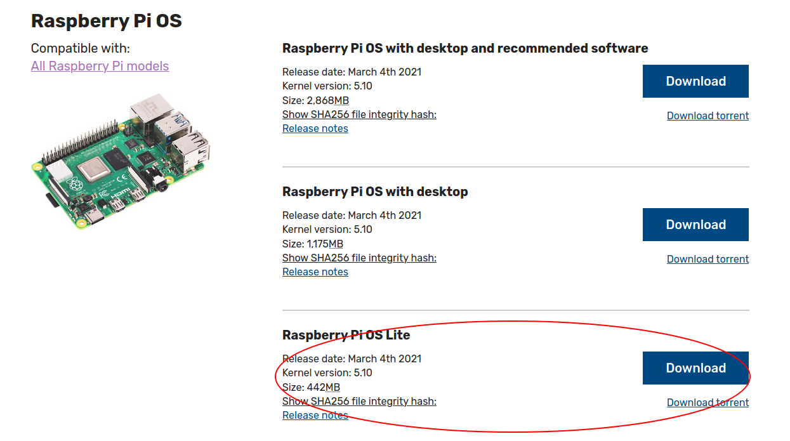
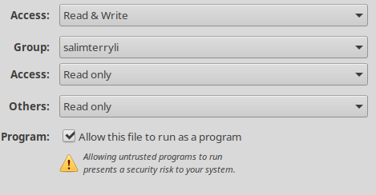
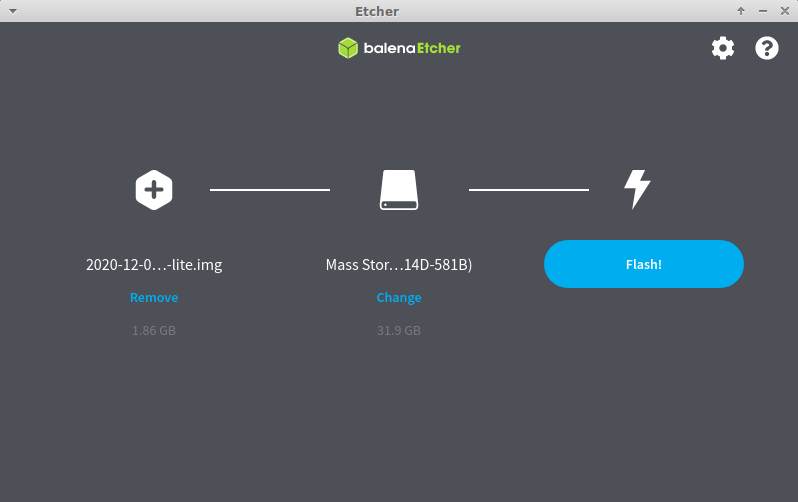
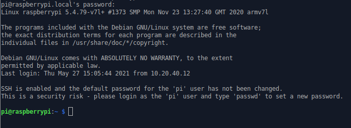
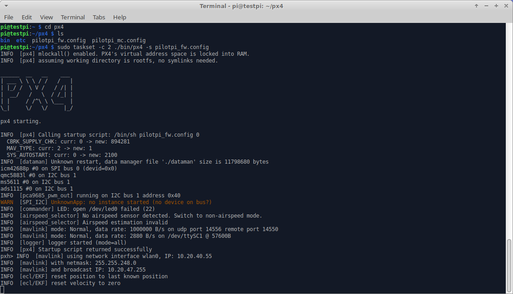

# 在树莓派上部署PX4

## 前言

### 何为树莓派

树莓派由注册于英国的慈善组织“Raspberry Pi 基金会”开发，Eben·Upton/埃·厄普顿为项目带头人。2012年3月，英国剑桥大学埃本·阿普顿（Eben Epton）正式发售世界上最小的台式机，又称卡片式电脑，外形只有信用卡大小，却具有电脑的所有基本功能，这就是Raspberry Pi电脑板，中文译名"树莓派"。


### 何为PX4

PX4是平台无关的自动驾驶仪软件（或称为固件），可以驱动无人机或无人车。它可以被烧写在某些硬件（如Pixhawk v2），并与地面控制站在一起组成一个完全独立的自动驾驶系统。

PX4地面控制站被称为QGroundControl，是PX4自驾系统不可分割的一部分，可以运行在Windows，OS X或Linux等多个平台。

使用QGroundControl，您可以将PX4固件烧写到硬件，设置机器，改变不同的参数，获得实时航班信息，创建和执行完全自主的任务。

### PilotPi拓展板

https://docs.px4.io/master/en/flight_controller/raspberry_pi_pilotpi.html

以外围最小化、功能最大化、可持续更新支持为目标而设计的树莓派飞控拓展版，适用于中型多旋翼（450轴距以上）、固定翼、车辆、船舶等其他模型。支持PX4，无APM支持企划。系统整体为全功能设计，限于接口数量而无冗余备份，暂无IMU恒温，适应于一般场合以及二次DIY，不适应于对稳定性具有严格要求的场合。

集成ICM42688与QMC5883为IMU方案。

支持一路串行遥控输入。（目前测试通过SBUS，不支持PPM）

提供两路串口用于连接外部数传与GPS，同时提供一路I2C总线用于连接外部罗盘

板载电池电压监控，空余三路ADC，可连接模拟电流计、模拟空速计


## 实验环境

- 一台联网的Ubuntu Desktop电脑
- 一台树莓派4B与SD卡
- 一个已知的WiFi网络
- 一套PilotPi拓展板
- 一个读卡器

## 部署过程

### 0x1 烧录系统

下载使用最新Raspberry Pi OS Lite。下载链接可以在[树莓派官网](https://www.raspberrypi.org/software/operating-systems/#raspberry-pi-os-32-bit)获得。注意不要使用带桌面环境的版本。



下载好后解压出来，得到系统的img镜像。

准备另一个软件：[etcher](https://www.balena.io/etcher/)。下载后会得到一个zip压缩包，解压开得到一个AppImage文件。

右键这个文件，点开属性，勾选上其中的可执行权限：



现在将树莓派的储存卡通过读卡器连接到电脑上。双击启动该软件。在第一个选项里选择解压出来的系统img文件，第二个选项选择刚刚的储存卡，然后点击第三个选项烧写系统。



会弹出一个提示框，需要输入当前用户密码。

等待其烧录完成。

### 0x2 启动前配置

烧录完成后，系统会自动挂载树莓派镜像。找到标有`boot`标签的分区打开，里面有`overlays`文件夹以及其他一堆文件。在**该目录**下右键打开终端，执行：

```
echo "" > ssh
```

创建一个名为`ssh`的文件。

执行`nano wpa_supplicant.conf`创建一个文本文件，在其中写入内容：

```
country=CN
ctrl_interface=DIR=/var/run/wpa_supplicant GROUP=netdev
update_config=1

network={
    ssid="wifi_ssid"
    psk="wifi_password"
}
```

将ssid与密码按需修改好，摁`CTRL+O`，`回车`写出文件。摁`CTRL+X`退出。

### 0x3 初步配置

弹出SD卡，将其插入树莓派，并上电。

等待其启动完成后，开启一个终端，执行：

```
ping raspberrypi.local
PING raspberrypi.local (10.20.40.55) 56(84) bytes of data.
64 bytes from raspberrypi.lan (10.20.40.55): icmp_seq=1 ttl=64 time=1233 ms
64 bytes from raspberrypi.lan (10.20.40.55): icmp_seq=2 ttl=64 time=221 ms
64 bytes from raspberrypi.lan (10.20.40.55): icmp_seq=3 ttl=64 time=5.18 ms
64 bytes from raspberrypi.lan (10.20.40.55): icmp_seq=4 ttl=64 time=11.3 ms
64 bytes from raspberrypi.lan (10.20.40.55): icmp_seq=5 ttl=64 time=5.81 ms
^C
--- raspberrypi.local ping statistics ---
5 packets transmitted, 5 received, 0% packet loss, time 4016ms
rtt min/avg/max/mdev = 5.179/295.345/1233.025/476.115 ms, pipe 2
```

使用`CTRL+C`打断ping过程。此时树莓派已启动完成并连上WiFi。使用ssh连接树莓派：

```
ssh pi@raspberrypi.local
```

默认密码：`raspberry`

如有需要，按提示输入`yes`并回车即可。



进行一些初步配置：

```
sudo raspi-config
```

使用该工具配置系统：

- System Options => Hostname 修改默认主机名（此例采用`testpi`）
- Interface Options => SPI 启用SPI
- Interface Options => I2C 启用I2C
- Interface Options => Serial Port 第一个关闭LoginShell，第二个开启SerialPort

然后选择Finish，先不要重启，选择No再回车。

换源：

参考[中科大软件源](http://mirrors.ustc.edu.cn/help/raspbian.html)的教程,以及[这一份](http://mirrors.ustc.edu.cn/help/raspberrypi.html)

### 0x4 进阶配置

下一步进行进阶的配置。

```
sudo nano /boot/config.txt
```

替换全部内容为：

```
# enable sc16is752 overlay
dtoverlay=sc16is752-spi1
# enable I2C-1 and set the frequency to 400KHz
dtparam=i2c_arm=on,i2c_arm_baudrate=400000
# enable spidev0.0
dtparam=spi=on
# enable RC input
enable_uart=1
# enable I2C-0
dtparam=i2c_vc=on
# switch Bluetooth to miniuart
dtoverlay=miniuart-bt
```

摁`CTRL+O`，`回车`写出文件。摁`CTRL+X`退出。

编辑另一个文件：

```
sudo nano /boot/cmdline.txt
```

在第一行最后添加

```
isolcpus=2
```

注意使用一个空格将前后内容隔开。

修改后整个文件内容应当类似于：

```
console=tty1 root=PARTUUID=c814c5f0-02 rootfstype=ext4 elevator=deadline fsck.repair=yes rootwait isolcpus=2
```

摁`CTRL+O`，`回车`写出文件。摁`CTRL+X`退出。

关机树莓派：

```
sudo poweroff
```

### 0x5 硬件检查

将PilotPi扩展板连接至树莓派上。使用附带的尼龙六角柱固定扩展板与树莓派。

上电。

使用新的主机名访问树莓派（示例将主机名改为了`testpi`）：

```
ssh pi@testpi.local
```

检查设备驱动：

```
ls /dev
```

在其中应当找到下列内容：

- `i2c-0`、`i2c-1`、`i2c-10`、`i2c-11`
- `spidev0.0`
- `ttyAMA0`
- `ttySC0`、`ttySC1`

检查I2C设备：

```
sudo apt-get install -y i2c-tools
i2cdetect -y 1
```

典型输出为：

```
pi@testpi:~ $ i2cdetect -y 1
     0  1  2  3  4  5  6  7  8  9  a  b  c  d  e  f
00:          -- -- -- -- -- -- -- -- -- -- 0d -- -- 
10: -- -- -- -- -- -- -- -- -- -- -- -- -- -- -- -- 
20: -- -- -- -- -- -- -- -- -- -- -- -- -- -- -- -- 
30: -- -- -- -- -- -- -- -- -- -- -- -- -- -- -- -- 
40: 40 -- -- -- -- -- -- -- 48 -- -- -- -- -- -- -- 
50: -- -- -- -- -- -- -- -- -- -- -- -- -- -- -- -- 
60: -- -- -- -- -- -- -- -- -- -- -- -- -- -- -- -- 
70: 70 -- -- -- -- -- 76 --
```

即成功连接并部署。

### 0x6 编译部署PX4

在电脑上找一个目录，右键打开终端，下载PX4源码：

```
git clone --recursive https://github.com/PX4/PX4-Autopilot.git
```

在电脑上安装[docker](https://docs.docker.com/engine/install/ubuntu/)：

```shell
sudo apt-get install \
     apt-transport-https \
     ca-certificates \
     curl \
     gnupg \
     lsb-release
curl -fsSL https://download.docker.com/linux/ubuntu/gpg | sudo gpg --dearmor -o /usr/share/keyrings/docker-archive-keyring.gpg
echo \
  "deb [arch=amd64 signed-by=/usr/share/keyrings/docker-archive-keyring.gpg] https://download.docker.com/linux/ubuntu \
  $(lsb_release -cs) stable" | sudo tee /etc/apt/sources.list.d/docker.list > /dev/null
sudo apt-get update
sudo apt-get install docker-ce docker-ce-cli containerd.io
```

获得树莓派的IP（替换对应主机名）：

```
ping testpi.local
```

到刚刚下载的**PX4-Autopilot源码目录**下执行：

```
./Tools/docker_run.sh "export AUTOPILOT_HOST=192.168.X.X; export AUTOPILOT_USER=pi; export NO_NINJA_BUILD=1; make scumaker_pilotpi_default upload"
```

编译完成后会提示上传，需要输入树莓派的用户密码。

### 0x7 运行PX4

ssh连接树莓派`ssh pi@testpi.local`

执行：

```
cd px4
sudo taskset -c 2 ./bin/px4 -s pilotpi_mc.config
```



此时已成功运行。

### 0x8 配置自动启动

在树莓派上修改文件：

```
sudo nano /etc/rc.local
```

在`exit 0`之前加入：

```shell
echo "25" > /sys/class/gpio/export
echo "in" > /sys/class/gpio/gpio25/direction
if [ $(cat /sys/class/gpio/gpio25/value) -eq 1 ] ; then
        echo "Launching PX4"
        cd /home/pi/px4 ; nohup taskset -c 2 ./bin/px4 -d -s pilotpi_mc.config 2>&1 > /home/pi/px4/px4.log &
fi
echo "25" > /sys/class/gpio/unexport
```

### 0x9 迁移至船模型

登录到树莓派并切换到px4目录：

```
ssh pi@testpi.local
cd px4
```

复制一份启动脚本

```
cp pilotpi_fw.config pilotpi_boat.config
```

修改新文件：

```
nano pilotpi_boat.config
```

按照以下列表进行替换：

| `mixer load /dev/pwm_output0 etc/mixers/AAERTWF.main.mix` | `mixer load /dev/pwm_output0 etc/mixers/generic_diff_rover.main.mix` |
| :-------------------------------------------------------: | :----------------------------------------------------------: |
|                  `param set MAV_TYPE 1`                   |                   `param set MAV_TYPE 11`                    |
|              `param set SYS_AUTOSTART 2100`               |               `param set SYS_AUTOSTART 50000`                |
|                 `airspeed_selector start`                 |                             删除                             |
|                `ms4525_airspeed start -X`                 |                 `#ms4525_airspeed start -X`                  |
|              `land_detector start fixedwing`              |                 `land_detector start rover`                  |
|                  `fw_att_control start`                   |                             删除                             |
|                 `fw_pos_control_l1 start`                 |                  `rover_pos_control start`                   |

修改`rc.local`将自动启动脚本中的配置文件换为`pilotpi_boat.config`：