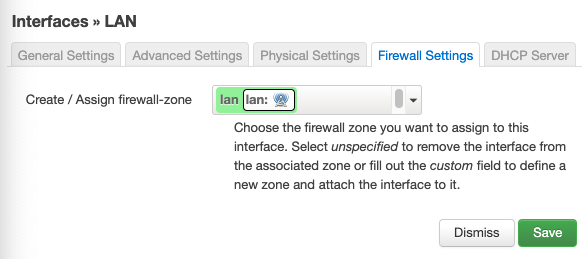
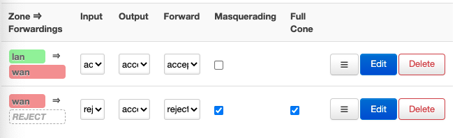

# OpenWrt

## 向Widora Neo 刷写系统

widora 内置系统提供了通过网页刷系统的功能，可以方便的通过网页进行刷机。

本次配置使用pc系统为ubuntu20.04.

### 0x01 连接pc与widora

使用网线连接pc与widora以太网口，给widora上电。上电过程中按住widora wps按钮，或reset 后按住wps按钮，看到指示灯闪烁10次后进入刷机模式。

### 0x02 将pc与widora配置到同一网段下以便进行通信

烧录模式下widora具有静态ip **192.168.1.111/24**（如不是此ip，请参阅widora官方文档），将pc机网口配置到同一网段下即可与widora进行局域网通信。具体操作流程如下：

在ubuntu网络设置中新建网口，配置为手动设置ip地址。ip设置为192.168.1.xxx，子网掩码255.255.255.0 。之后即可在网页端widora ip访问到系统刷写界面，选择你要上传的系统文件上传即可。系统文件的下载这里暂不讨论，请查阅官方文档。

### 0x03 配置路由

刷机完成后widora将自动启动，以太网口默认为dhcp状态。路由器配置界面ip为192.168.1.1，访问即可进入路由器配置。

主要配置内容：

- 在interface中增加一个接口。默认设置中，以太网口与无线网口处于桥接状态，对外提供dhcp服务。
- 配置方式：新建一个LAN口在wlan0上，对外提供dhcp服务，protocol为static address。之后即可连接上这一wifi并进入配置页面
- 通过wifi进入配置界面后，将WAN口配置为DHCP client。
- 在firewall配置下，将LAN口添加到lan firewall zone下。

- 之后理论上即可接入网络。