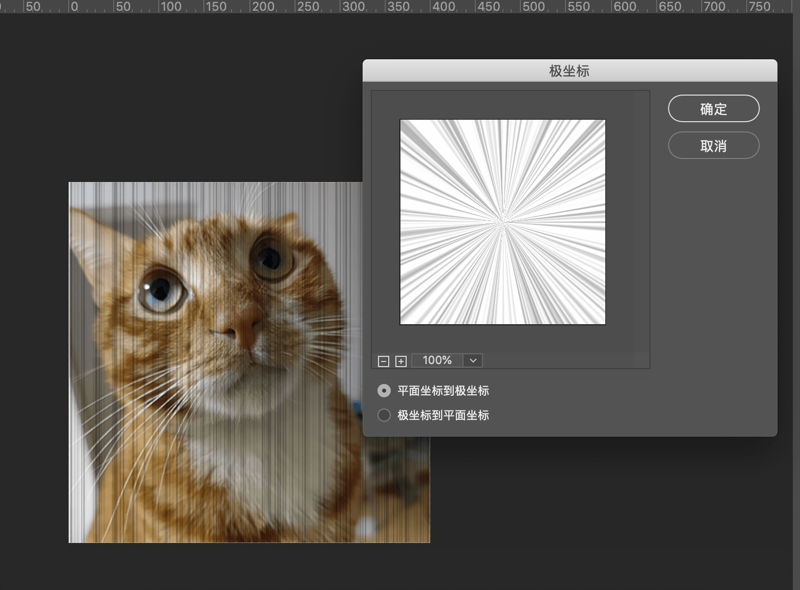

# PS集中线绘制

1. 打开所需绘制图片
2. 新建图层，图层模式调为正片叠底，填充白色

3. 滤镜->杂色->添加杂色，具体选项见图。可根据集中线数目需求调整杂色数量。

4. 滤镜->其它->位移。

5. 滤镜->扭曲->极坐标。

6. 目前效果如图。下一步需要删除不需要的部分。

使用椭圆选区工具选出要擦除的部分。按shift+F6对选区边缘进行羽化，羽化半径根据个人需求调整。

按delete键进行删除。

**注：此处由于开始添加杂色较少，效果较为一般。可根据个人需要多添加杂色。**

---

*tip：可使用ps动作功能记录以上操作，需要时进行一键添加*

