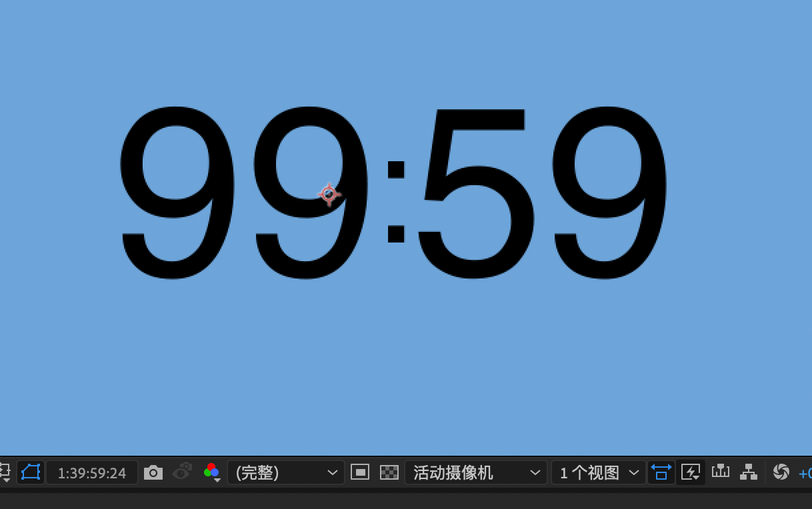
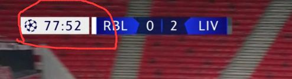
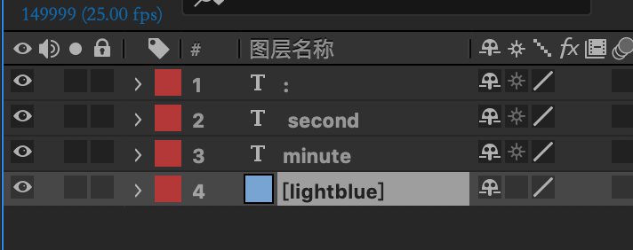
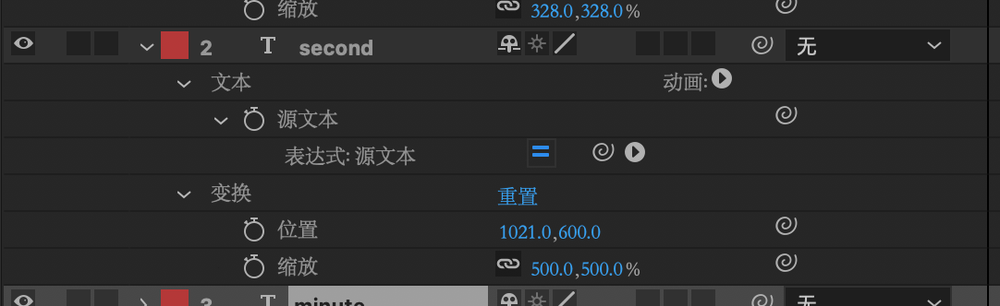
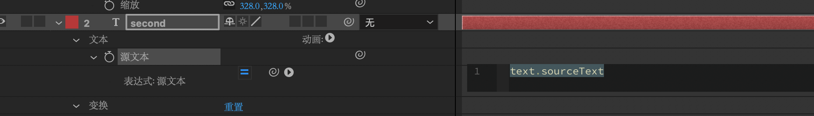

# ae使用expression制作计时器效果

## 最终效果如图：



## 制作起因

视频需要一个球赛的计时器效果，分钟在60min时不进位至小时，而是继续递增，如图:



> 如仅需要常规计时器可通过pr**时间码**实现效果，无需使用ae

## 制作流程：

1. 打开ae，新建合成
2. 新建三个文本框分别记录分钟和小时，以及分隔的冒号



3. 选中second文本框，键盘快捷键`uu`呼出原文本编辑



4. `alt+鼠标左键`单击源文本前码表添加表达式。此时在代码框中默认为对本对象的引用，此处不需要，删除即可。



5. 代码使用*javascript*, 这里仅说一下ae特有的一些属性：
`value`: 对自身当前值的引用。
`time`: 全局变量，每秒递增1.

6. 有地方写代码了以后各位程序猿兄弟们就可以根据需求自由发挥了：D， 这里贴一下我在这里使用的代码

   ```javascript
   a = Math.floor(time) % 60;
   if(a < 10)
   	value = "0" + a;
   else
   	value = a;
   ```

   minute同理，如法炮制：

   ```javascript
   a = Math.floor(time / 60);
   if(a < 10)
   	value = "0" + a;
   else
   	value = a;
   ```

   

之后根据需求修改字体/背景等属性后导出即可。