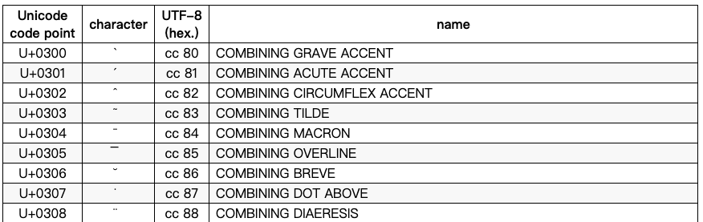

# 乱码生成器

## 效果演示：


福ͧͨͥ报ͧͨͥ


g̛̮̪̍̐l̮̩̂̋̕ḯ̛̥̋t̢̯̟̊̄ç̠̩̠̇h̡̟̬̩̔

𝓜𝓪𝓽𝓱𝓮𝓶𝓪𝓽𝓲𝓬𝓪𝓵 𝓫𝓸𝓵𝓭 𝓼𝓬𝓻𝓲𝓹𝓽

**本质上是在源文本添加了部分不常用unicode字符**

Eg. 

其中unicode code point 为字符对应unicode字符编码，utf-8为字符的UTF8十六进制编码。使用python `chr()`方法进行转换时使用的为**Unicode code point**, 这一点需要注意。

更多unicode编码见[unicode编码表](https://www.utf8-chartable.de/unicode-utf8-table.pl?start=768&number=1024)。

## 部分python知识点：

### 字符转换

使用`chr()`将unicode code point 转化为字符，`ord()`将字符转化为unicode code point.

使用`int(value, base)`将字符串（或数值，本项目未用到）转化为整数。base指定value的进制，默认值为10.

|Parameter|Description|
|---|---|
|value|A number or a string that can be converted into an integer number|
|base|A number representing the number format. Default value: 10|

### json

使用`target = json.load(file)`读取json文件。E.g:

```python
with open("dict.json", mode="r") as f:
    garbled_dict = json.load(f)
```

`json.load()`根据json文件内容返回字典或列表。

更多json用法未在此记录。